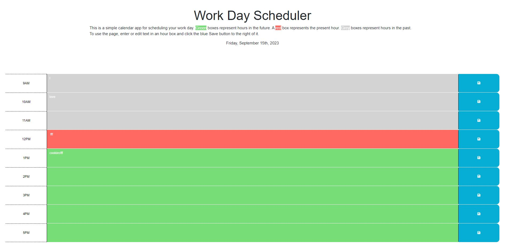

# Work Day Scheduler Webpage

## Description

My motivation to build this project was so that I could gain additional experience with using JavaScript to add behavior to a webpage.  I built this project so that in addition to gaining more basic practice with JavaScript, I could also start learning how to use external JavaScript libraries.  This project solves the problem of an employee needing to be able to schedule events throughout his or her work day, from 9AM - 5PM. In this project, the main new skill I learned was integrating the Day.js library into my own JavaScript application.  I acquired some more practice with saving data to and retrieving data from local storage.  I also learned a little bit about event debouncing.  For this project, I took the provided starter code, added the full set of normal workday hours, and then added JavaScript so that when the user clicks the corresponding save button, the text in the corresponding textarea will be saved to local storage.  If the user refreshes the page, this text will stay on the page. 

## Table of Contents (Optional)

This README isn't that long, so N/A.

## Installation

N/A

## Usage

Here is a link to the deployed application: [https://theboss1485.github.io/work-day-scheduler-webpage/](https://theboss1485.github.io/work-day-scheduler-webpage/)

To use the application, please bear in mind that an hour in the past is represented by a gray box, the present hour is represented by a red box, and an hour in the future is represented by a green box.  To add an event to the webpage, type text into one of boxes (whether gray, red, or green) on the page.  Click the blue Save button to the right of that box.  This will save the event to local storage, and you will receive a confirmation message near the top of the page.  Then, if you refresh the page or open it in a new tab of the same browser, the saved event will persist on the page. To delete the event, delete the text from its box and click the aforementioned Save button.  You will once again receive a confirmation message and if you refresh the page, the event will not reappear.

Here is a screenshot of the application: 

## Credits

I didn't have any human collaborators on this project.  However, OSU's Xpert Learning Assistant AI did help me out with a little bit of the code.

## License

This project is under an MIT license.  Please see the license in the GitHub repository for more information.

## Badges

I don't have any badges to display.

## Features

This project is an event scheduler that allows the user to type events into a textbox, click a save button, and then have them persist when refreshing the page or opening a new tab of the same browser.

## How to Contribute

This was an assigment I personally completed, so N/A.

## Tests

N/A